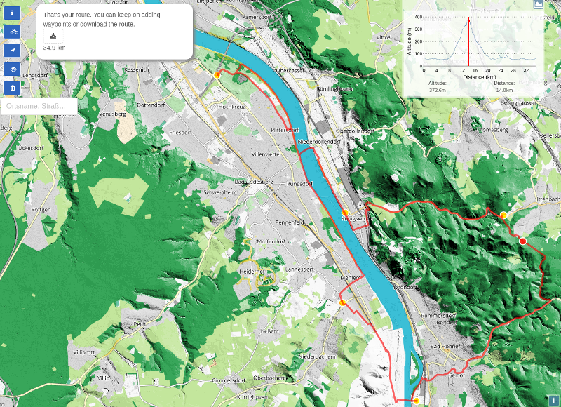

# Bike round trip planner
A bike round trip planner using the api of openrouteservice

## Info
This is a simple react-geo based round trip planner for biking tours.
While waypoints can be set individually or calculated with help of turf.js, directions are based on the api of openrouteservice.
**Optional** For using a custom mapstyle that focuses on biking needs, additional steps and tools are needed (see below).

<div align="center"></div>

## Install
Clone repository to your local drive
```javascript static
npm i
```

## Start
```javascript static
npm start
 ```

## Install map style
1. Download an OSM data extract from http://download.geofabrik.de, e.g. for Nordrhein-Westfahlen:
```javascript static
http://download.geofabrik.de/europe/germany/nordrhein-westfalen-latest.osm.pbf
```

2. **PostgreSQL:** Create Database and activate PostGIS extension.
```javascript static
CREATE DATABASE bike_nrw;
CREATE EXTENSION POSTGIS;
```

3. Import the OSM dataset into the database using [Imposm](https://github.com/omniscale/imposm3) See `/mapstyle` for config and mapping file
```javascript static
imposm3 import -config config.json -read nordrhein-westfalen-latest.osm.pbf -write -limitto nrw.geojson
```

4. **Geoserver:** Install the following extensions:
  - Importer
  - Vector tiles
  - [mbstyle](http://ares.opengeo.org/geoserver/master/community-latest/)
  - Import all database tables (see step 4) using Importer. Important: Activate *application/x-protobuf;type=mapbox-vector* (image format) in the Tile-Cache configuration.
  - Create new style (Format: mystyle) and import the *bikestyle.json* file from `/mapstyle`
  - Create a new group layer (no need for adding the single layers) and apply the bike style

 5. **Mapproxy:** Config file: `/mapstyle/mapproxy.yaml`
```javascript static
 mapproxy-util serve-develop mapproxy.yaml -b localhost:8081
 ```

 6. `src/mapconfig.js`: Comment out line 59 and 60. Comment in line 61 to 62. That's it.

 ## FAQ
1. **Why NRW?**
 This project is among others a showcase for using newly published open geodata by the authorities in combination with existing open data and tools. Of course the app will work outside of NRW, too. But the shaded relief layer is limited to the state of NRW.
2. **Can I use the app for plan round hiking routes?**
Yes, just toogle the button with the bike icon. This will set the directions profile to hiking.
